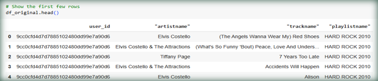
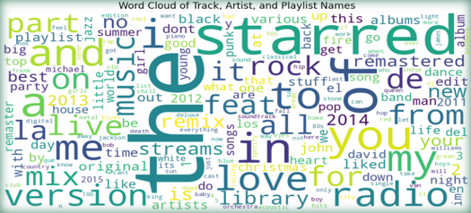

# 🎵 Spotify Playlist Recommender System Using NLP

## overview
This project leverages Natural Language Processing (NLP) techniques to develop a personalized playlist recommender system. By analyzing playlist data from Spotify, the system identifies contextual relationships between songs and generates tailored recommendations based on user preferences.

**Business question ?** "How can we develop a system to recommend personalized playlists to users, leveraging playlist data alone to identify contextual relationships between songs and generate relevant suggestions for a given input song?“

  
_________________________________________

## Table of Contents

- [Overview](#overview)
- [Project Functionalities](#project-functionalities)
- [Installation](#installation)
- [Usage Example](#usage-example)
- [Dataset](#dataset)
- [Word2Vec Model](#word2vec-model)
- [Siamese Neural Network (SNN) with Triplets Model](#siamese-neural-network-snn-with-triplets-model)
- [Technologies Used](#technologies-used)
- [Results](#results)
- [Contributing](#contributing)
- [License](#license)
- [Acknowledgements](#acknowledgements)
- [Notes](#notes)
- [Goals](#goals)
- [Future work](#future-work)
- [Repository Structure](#repository-structure)


____________________________________________________________________________
## Project Functionalities

- Artist-Based Recommendations: Focuses on artist similarity using fuzzy matching techniques to handle inconsistencies in naming conventions.
- Word2Vec Embeddings: Generates song embeddings to represent relationships within playlists.
- Hard Negative Sampling: Enhances model training by focusing on challenging negative examples.
- Evaluation Metrics: Includes Precision@K, Recall@K, and Mean Average Precision (MAP) to assess performance.
- Cosine Similarity: Used to compute the similarity between song embeddings for accurate recommendations.
- Cleaning and preprocessing of Spotify playlist data to handle missing values, inconsistencies, and special characters.
- Visualization of key insights, such as top artists, track distributions, and playlist diversity.

_____________________________________________________________________________________________________________________

## Installation
**Note**: The commands below should be run in the terminal (Command Prompt, Bash, or Shell), not inside Jupyter Notebook.

1. Clone this repository:
```bash
git clone https://github.com/ortall0201/Spotify-Playlist-Recommender-System-Using-NLP.git
cd Spotify-Playlist-Recommender-System-Using-NLP
```

3. Install dependencies:
```bash
pip install -r requirements.txt
```

4. (Optional) Install Jupyter Notebook to explore the project interactively:
```bash
pip install notebook
```

_____________________________________________________________________________________________________________________

## Usage Example

1. Preprocess the dataset:

- Clean and tokenize the raw playlist data.
- Generate Word2Vec embeddings using the provided scripts.
  
2. Train the model:

- Run the training script with default parameters or adjust for customization:
```bash
python train_model.py
```

3. Generate recommendations:

- Use the script to recommend songs based on input playlists:
```bash
python recommend.py --input_playlist "playlist_name"
```
______________________________________________________________________________________________________________________
## Dataset

- Name of the dataset: Spotify Playlists-
- Type of the dataset: 1.2GB of tabular data for music recommendation

- The project uses the Spotify Playlists Dataset, which includes detailed information on user-generated playlists, artists, tracks, and more. This dataset is processed and analyzed in compliance with its terms of use.

- Options to obtain dataset: 
1. Download the dataset from Kaggle: https://www.kaggle.com/datasets/andrewmvd/spotify-playlists/data?select=spotify_dataset.csv
2. Use direct public links to the dataset in the project, without downloading.
   
- The dataset is sourced from Kaggle and includes:
   - User ID
   - Playlist Names
   - Track Names
   - Artists
- Note: All data is used for educational purposes under Spotify's terms of use.



______________________________________________________________________________________________________________________
## Word2Vec Model
- Objective: Learn dense vector representations (embeddings) of songs based on their contextual relationships within playlists. The embeddings capture semantic 
   similarities between songs, enabling the model to recommend relevant tracks based on co-occurrence patterns.

- Architecture:

   - Skip-Gram Model: Word2Vec uses the Skip-Gram architecture, where the goal is to predict the surrounding context (songs) for a given input song. This captures 
     relationships between songs that frequently appear together in playlists.
- Input and Output:
   - Input: A single song (treated as a "word").
   - Output: A probability distribution over the surrounding songs in the playlist.
- The model learns to map songs to a dense, continuous vector space where similar songs are closer together.
  
- Embedding Space:

  - Each song is represented as a vector in a high-dimensional space.
  - The vector space is structured so that songs with similar co-occurrence patterns (e.g., appearing in similar playlists) are placed closer together.
    
- Optimization:

  - Negative Sampling: Speeds up the training process by focusing on a small subset of "negative" examples (songs that do not appear in the same context) instead 
    of all possible songs.
  - Softmax Approximation: The Skip-Gram model uses an approximation of softmax to efficiently compute the probability distribution.
    
- Similarity Measure:

  - Cosine Similarity: After training, the similarity between two song embeddings is computed using cosine similarity, which measures the angle between their 
    vector representations. Songs with higher similarity scores are more likely to be relevant to each other.
  
- Evaluation:

   - Precision: Measures the proportion of recommended songs (by artist) that are relevant.
   - Recall: Measures the proportion of relevant songs (by artist) included in recommendations.
   - F1 Score: Balances precision and recall to provide a single performance metric.
     
- Training Process:

   - Songs in playlists are tokenized (each song looks like a concatenated string "artistname:trackname" and is treated as a "word").
   - The Skip-Gram model is trained on these sequences of songs to generate embeddings.
   - After training, the embeddings can be used to compute similarities and make recommendations.
______________________________________________________________________________________________________________________
## Siamese Neural Network (SNN) with Triplets Model
- Objective: Train two identical neural networks to learn meaningful embeddings of songs, where the embeddings of similar songs are close, and those of dissimilar songs are far apart in the vector space. The model is optimized using triplet loss.

- Architecture:

   - Two Networks: The Siamese Network consists of two identical subnetworks with shared weights. Each network takes a song as input and produces its embedding in 
      a dense vector space.
   - Triplet Input:
       - Anchor Song: A song taken from a playlist.
       - Positive Song: A song from the same playlist as the anchor.
       - Negative Song: A song from a different playlist.
    - The network ensures that the embedding for the anchor song is closer to the positive song and farther from the negative song.
      
- Loss Function:

    - Triplet Loss: Ensures that the distance between the embeddings of the anchor and positive songs is smaller than the distance between the embeddings of the 
      anchor and negative songs, with a margin for separation.
      
- Evaluation:

    - Precision@K: Measures the proportion of top-K recommended songs that are relevant.
    - Recall@K: Measures the proportion of relevant songs included in the top-K recommendations.
    - Mean Average Precision (MAP): Evaluates the quality of ranked recommendations.
      
- Training Process:

    - Songs are grouped into triplets (anchor, positive, negative).
    - Each song in the triplet passes through the network to generate embeddings.
    - Distances between embeddings are computed to calculate the triplet loss, which guides the optimization process.
______________________________________________________________________________________________________________________
## Technologies Used

The project leverages the following technologies and libraries:

- Python Libraries
  - Core Libraries:

     - numpy: For numerical computations.
     - pandas: For data manipulation and analysis.
     - random: For generating random samples.
     - os: For interacting with the file system.
     - pickle: For saving and loading data objects.
     - gc: For garbage collection and memory management.
       
- Machine Learning and NLP:

  - torch and torch.nn: For building and training the Siamese Neural Network.
  - torch.optim: For optimization during model training.
  - torch.nn.functional: For using various neural network functions.
  - sentence_transformers: For text-based embedding models.
  - sklearn:
      - train_test_split: For splitting the dataset.
      - cosine_similarity: For computing similarity between embeddings.
      - normalize: For normalizing data.
        
- Visualization:

  - matplotlib: For creating visualizations.
    
- Utilities:

  - tqdm: For progress bars.
  - multiprocessing: For parallel processing.
    
- Tools and Frameworks
  
  - Google Colab: Used for running the notebooks and leveraging GPU resources.
  - PyTorch: Framework for building and training deep learning models.

____________________________________________________________________________________________________________________

## Results

Best Model (in Word2vec): Achieved 82.3% F1 Score, using an artist-based Word2Vec recommender system with fuzzy matching.
Evaluation Metrics:
Precision: 81.1%
Recall: 87.3%
F1 Score: 82.3%
Visualization: Example of epochs convergence generated by the best word2vec model:

_____________________________________________________________________________________________________________________
## License
This project is licensed under the MIT License.
______________________________________________________________________________________________________________________
## Acknowledgements

- Spotify: For providing the data used in this project.
- Kaggle: For hosting the dataset.
- **Contributors:**
   - Manor Shpritz   Email: manorsh@gmail.com
   - Ortal Lasry     Email: Ortalgr@gmail.com
   - Or Cohen Raviv  Email: or.cohen.raviv@gmail.com
___________________________________________________________________________________________________________________
## Notes

To further improve the project:

- Word2Vec - Training the model on tokens created by playlist-trackname, to make the model more robust and reduce the 
need in fuzzy matching. Thus, creating a hybrid solution of a recommender system first trained to find artist 
recommended tracks (by user's artist:song preference) and then train on finding the most recommended songs of other
artists.
_____________________________________________________________________________________________________________________
## Goals

- Extract meaningful insights from Spotify playlist data.
- Build a scalable and effective music recommender system using NLP.
- Explore the potential of embedding techniques for playlist and track analysis.
_____________________________________________________________________________________________________________________
## Future Work

Incorporate other features like time series to capture the mood of the user and give him more refined playlists
recommendations.

_____________________________________________________________________________________________________________________
## Repository Structure

Spotify-Playlist-Recommender-System-Using-NLP/ 
├── Ortal/ │ ├── Word2Vec_Model.ipynb: Implementation of the Word2Vec-based song embedding and recommendation system. 
│            └── Supporting files for Word2Vec training and evaluation.
├── Manor/ 
│          ├── Triplet_Formation_Model.ipynb: Siamese Neural Network implementation using triplets. 
│          └── Supporting scripts for model training and validation. 
├── Or/ 
│          ├── Siamese_Enhancements.ipynb: Enhancements and evaluation for the Siamese Neural Network. 
│          └── Visualization and result analysis tools. 
├── README.md: Documentation for the project. 
├── requirements.txt: List of dependencies required to run the project.

